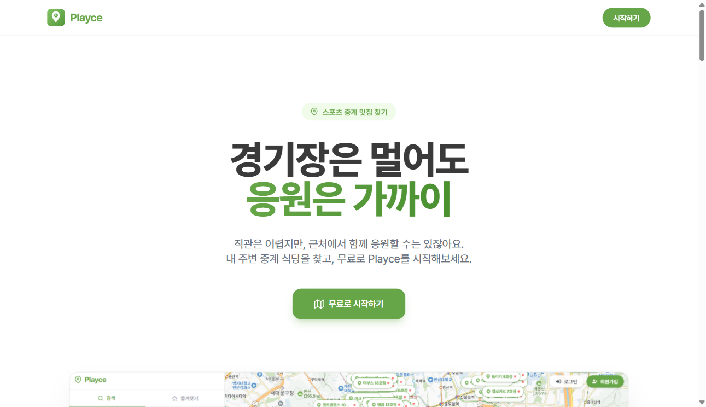
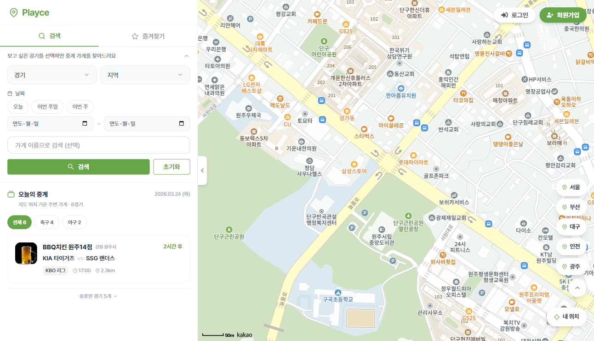
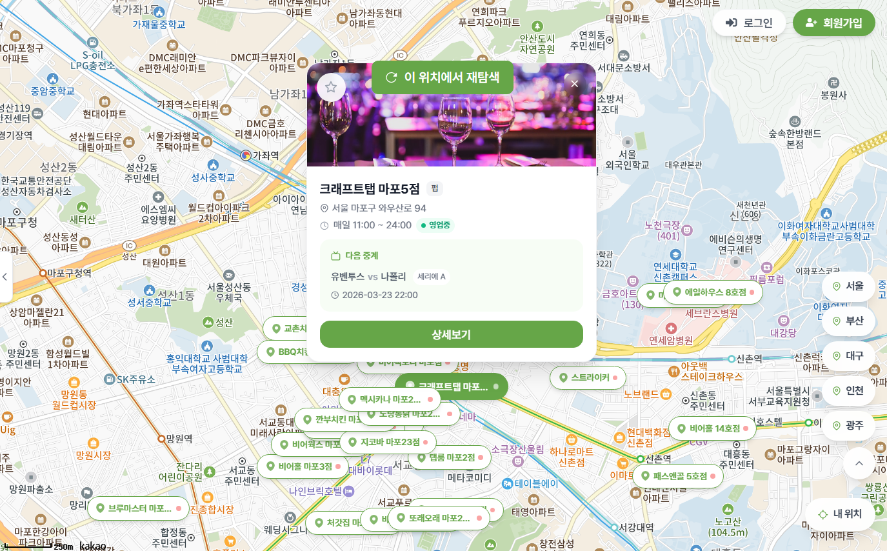
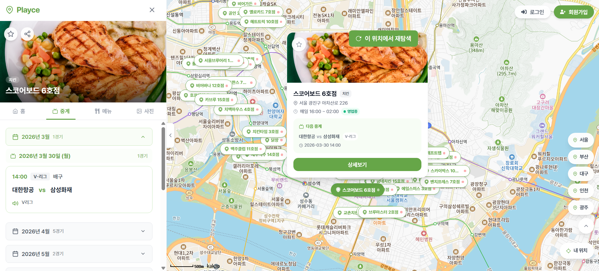
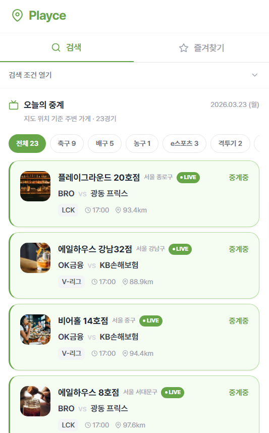
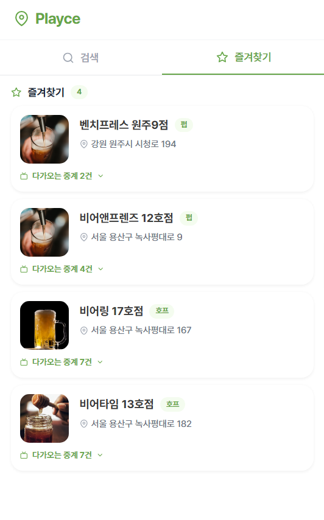
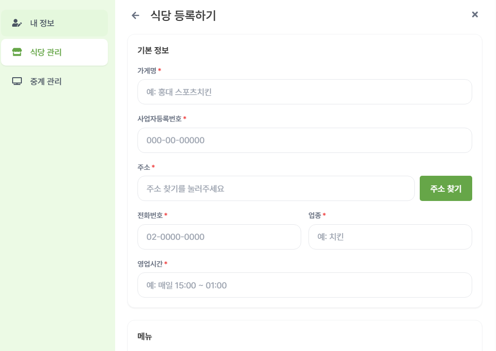
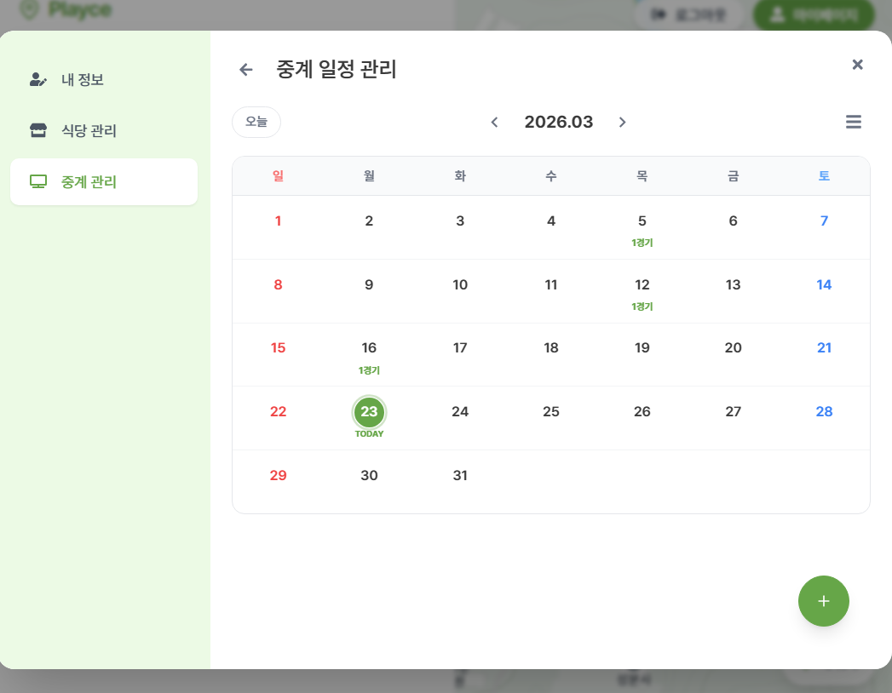
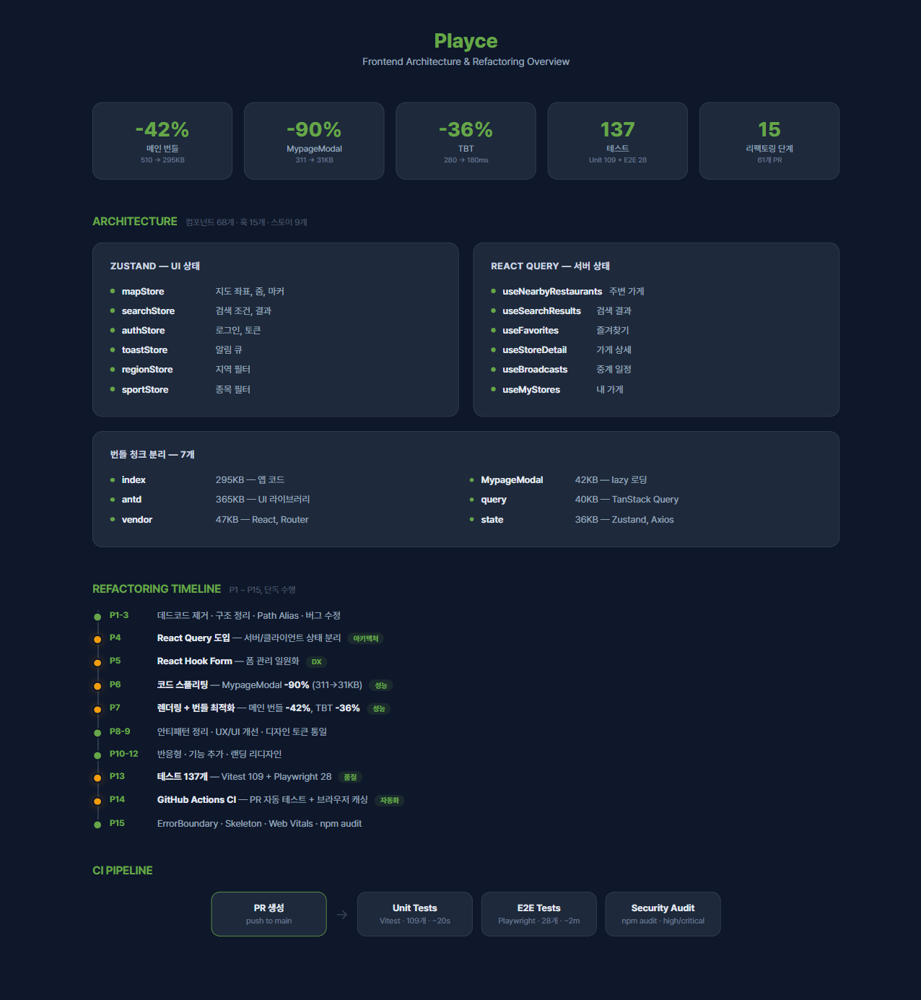
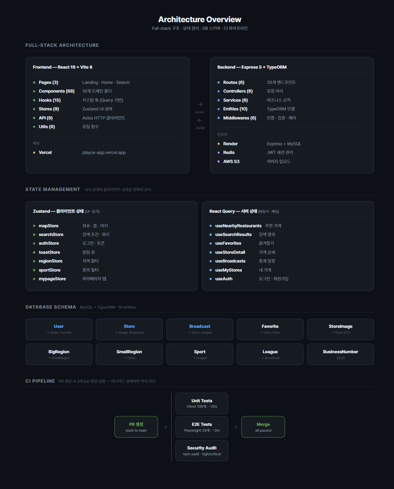

<div align="center">

# Playce

**스포츠 중계 맛집 찾기 — 위치 기반 스포츠 중계 식당 검색 플랫폼**

카카오맵 위에 스포츠 중계를 틀어주는 식당을 표시하고,<br>
종목·리그·지역·날짜로 검색하고, 즐겨찾기로 관리하는 서비스

[](https://playce-app.vercel.app)

<br>



</div>

<br>

## 목차

- [프로젝트 개요](#프로젝트-개요)
- [기술 스택](#기술-스택)
- [담당 기능 상세](#담당-기능-상세)
- [리팩토링](#리팩토링)
- [아키텍처](#아키텍처)
- [테스트 & CI](#테스트--ci)
- [실행 방법](#실행-방법)

<br>

---

## 프로젝트 개요

> "직관은 비싸고, 혼자 보기엔 아쉽다. 근처 식당에서 같이 응원하자."

| 항목 | 내용 |
|:---:|------|
| **프로젝트 기간** | 2025.06 ~ 07 (팀 개발 6주) |
| **리팩토링 기간** | 2026.03 (단독 3주) |
| **팀 구성** | 6명 — FE 3 · BE 3 |
| **역할** | **프론트엔드 메인 개발자** — FE 코드 52% 직접 작성 |
| **리팩토링** | 단독 **15단계 · 61 PR** — 성능·아키텍처·테스트·CI 전면 개선 |

<br>

---

## 기술 스택

### Frontend

| 분류 | 기술 |
|:---:|------|
| **Core** | React 19 · TypeScript · Vite 6 |
| **상태 관리** | Zustand 5 (클라이언트) · TanStack Query 5 (서버) |
| **폼** | React Hook Form 7 |
| **스타일링** | Tailwind CSS · Framer Motion |
| **지도** | Kakao Maps SDK |
| **테스트** | Vitest · Playwright |
| **배포** | Vercel |

### Backend

| 분류 | 기술 |
|:---:|------|
| **Core** | Express 5 · TypeScript |
| **ORM · DB** | TypeORM · MySQL |
| **인증** | JWT · Redis (세션 관리) |
| **스토리지** | AWS S3 (이미지 업로드) |
| **문서** | Swagger (API 명세) |
| **배포** | Render |

### DevOps

| 분류 | 기술 |
|:---:|------|
| **CI** | GitHub Actions — Unit + E2E + npm audit 병렬 실행 |
| **모니터링** | Web Vitals (LCP · FCP · CLS · FID · TTFB) |

<br>

---

## 담당 기능 상세

### 팀 개발 담당 (2025.06 ~ 07)

<details open>
<summary><b>카카오맵 기반 식당 검색</b></summary>

<br>

카카오맵 JavaScript SDK를 연동하여 **현위치 기반 주변 식당 검색 시스템** 구현.

- **Geolocation API**로 사용자 현위치 자동 감지 → 주변 중계 식당 마커 렌더링
- **다중 필터 검색** — 종목 · 리그 · 지역(대/소) · 날짜를 조합한 복합 검색
- **도시 퀵네비게이션** — 12개 주요 도시 원클릭 이동 (서울, 부산, 대구 등)
- **마커 → 팝업 → 상세** 3단계 인터랙션 플로우 설계
- 지도 줌 레벨·중심 좌표 상태를 Zustand로 관리하여 페이지 이동 시에도 지도 상태 유지

| 지도 검색 + 오늘의 중계 | 마커 클릭 → 팝업 → 상세 연결 |
|:---:|:---:|
|  |  |

</details>

<details>
<summary><b>식당 상세보기</b></summary>

<br>

식당 정보를 **탭 구조(홈 / 메뉴 / 사진 / 중계)**로 구조화하여 정보 탐색 효율 개선.

- 중계 일정을 **날짜별 그룹핑 + 시간순 정렬**로 한눈에 확인
- 즐겨찾기 토글 — 로그인 상태에 따라 즉시 반영 또는 로그인 유도
- 식당 영업 상태(영업중/준비중/마감) 실시간 표시
- 메뉴 리스트 · 사진 갤러리 · 주소 복사 기능

| 식당 상세 + 중계 탭 | 중계 일정 날짜별 그룹핑 |
|:---:|:---:|
|  |  |

</details>

<details>
<summary><b>오늘의 중계</b></summary>

<br>

현재 진행 중인 스포츠 중계를 한눈에 확인하고, 가까운 식당을 바로 찾을 수 있는 기능.

- **LIVE 하이라이트** — 현재 진행 중인 중계를 상단에 강조 노출
- **종목별 탭 필터** — 축구, 야구, 농구 등 종목별 빠른 전환
- **거리순 정렬** — 현위치 기준으로 가까운 식당부터 표시
- 모바일 반응형 카드 레이아웃



</details>

<details>
<summary><b>즐겨찾기</b></summary>

<br>

관심 식당을 저장하고, 해당 식당의 예정된 중계 일정까지 한 번에 확인.

- **비로그인 차단 + 유도 UI** — 즐겨찾기 클릭 시 로그인 모달 노출
- 가게별 **중계 일정 토글** — 즐겨찾기 목록에서 바로 중계 확인
- 즐겨찾기 추가/삭제 API 연동 + 낙관적 업데이트



</details>

<details>
<summary><b>마이페이지</b></summary>

<br>

사장님이 자신의 식당과 중계 일정을 직접 관리할 수 있는 대시보드.

- **프로필 관리** — 닉네임 수정, 프로필 이미지 업로드 (AWS S3)
- **식당 CRUD** — 등록 · 수정 · 삭제, 사업자번호 검증, 메뉴/사진 관리
- **중계 캘린더** — 날짜별 중계 일정 등록/수정/삭제, 종목·리그·팀 선택 UI

| 식당 등록 폼 | 중계 캘린더 관리 |
|:---:|:---:|
|  |  |

</details>

<br>

### 단독 리팩토링 후 추가 (2026.03)

<details>
<summary><b>인증 시스템</b></summary>

<br>

JWT 기반 인증 플로우를 프론트엔드에서 전담 구현.

- **로그인/회원가입 모달** — React Hook Form 기반 유효성 검증 + 에러 표시
- **Axios 인터셉터** — 401 응답 시 자동 로그아웃 + 로그인 모달 노출
- **비밀번호 초기화** — 이메일 인증 → 토큰 검증 → 비밀번호 변경 3단계 플로우
- **토큰 관리** — localStorage 저장 + Zustand authStore 동기화

</details>

<details>
<summary><b>검색 고도화</b></summary>

<br>

기존 검색을 React Query 기반으로 재설계하여 성능과 UX 모두 개선.

- **React Query 캐싱** — 동일 검색 조건 재요청 방지, staleTime 기반 자동 리페칭
- **URLSearchParams 동기화** — 검색 조건이 URL에 반영되어 공유·뒤로가기 지원
- **선언적 로딩/에러** — isLoading → Skeleton UI, isError → ErrorBoundary 연결

</details>

<br>

---

## 리팩토링

팀 개발 종료 후, **단독으로 15단계 · 61 PR에 걸쳐 코드 품질 · 성능 · 테스트 · CI를 전면 개선.**

### 왜 리팩토링했는가

팀 프로젝트 코드를 분석한 결과, 세 가지 구조적 문제를 발견:

| 문제 | 구체적 상황 | 영향 |
|------|------------|------|
| **서버/클라이언트 상태 혼재** | API 응답을 Zustand에 직접 저장 → 캐싱, 리페칭, 무효화를 전부 수동 관리 | 코드 복잡도 ↑, 데이터 불일치 버그 |
| **번들 비대화** | MypageModal(311KB) 등 모든 모달이 초기 번들에 포함 | FCP 저하, 사용하지 않는 코드 로딩 |
| **테스트 부재** | 테스트 0개 — 수동 클릭으로만 검증 | 리그레션 감지 불가, 배포 불안 |

### 핵심 성과

<div align="center">



</div>

### 단계별 상세

| 단계 | 핵심 | 문제 → 해결 |
|:---:|------|------------|
| **P1-3** | 기반 정리 | 데드코드 30+ 파일 제거 · Path Alias · 폴더 구조 재설계 |
| **P4** | React Query | Zustand에 혼재된 서버 상태 → TanStack Query로 분리, 캐싱·리페칭 자동화 |
| **P5** | Hook Form | useState 수동 폼 관리 → React Hook Form으로 검증·에러·상태 선언적 처리 |
| **P6** | 코드 스플리팅 | 초기 번들에 포함된 311KB 모달 → lazy() + Suspense로 **90% 감소** |
| **P7** | 렌더링 + 번들 | Profiler 분석 → memo/useMemo/useCallback 선별 적용 + manualChunks 7개 분리 |
| **P8-9** | 버그 + UX | 비동기 레이스 컨디션 수정, Skeleton UI, 중복 제출 방지 |
| **P10** | 기능 추가 | 인증 시스템 (JWT + 인터셉터), 검색 고도화 (React Query 캐싱) |
| **P11-12** | UI/반응형 | 모바일 터치 대응, 랜딩 리디자인 (B2C 인터랙티브) |
| **P13** | 테스트 | 0개 → **137개** — 로직은 Vitest(109), 유저 시나리오는 Playwright(28) |
| **P14** | CI | PR마다 3개 job 병렬 — Unit + E2E + npm audit 보안 게이트 |
| **P15** | 에러/로딩 UX | ErrorBoundary 크래시 복구, Skeleton UI, Web Vitals 측정 |

<br>

---

## 아키텍처

<div align="center">



</div>

### Full-stack 구조

```
Frontend (Vercel)                           Backend (Render)
React 19 + Vite 6                           Express 5 + TypeORM
├── Pages (3)                               ├── Routes (6) — 26 endpoints
├── Components (68)          ← Axios →      ├── Controllers (6)
├── Hooks (15)                  JSON         ├── Services (6)
├── Stores (9) — Zustand                    ├── Entities (10) — MySQL
└── Utils (9)                               ├── Middlewares (6) — JWT + Redis
                                            └── AWS S3 — 이미지 업로드
```

### 상태 관리 전략

리팩토링의 핵심 — **서버 상태와 클라이언트 상태를 명확히 분리.**

| Zustand (클라이언트 상태) | React Query (서버 상태) |
|:---:|:---:|
| mapStore — 좌표, 줌, 마커 | useNearbyRestaurants — 주변 가게 |
| searchStore — 검색 조건 | useSearchResults — 검색 결과 |
| authStore — 로그인, 토큰 | useFavorites — 즐겨찾기 |
| toastStore — 알림 큐 | useStoreDetail — 가게 상세 |
| regionStore — 지역 필터 | useBroadcasts — 중계 일정 |
| sportStore — 종목 필터 | useMyStores — 내 가게 |

### DB 스키마 (MySQL + TypeORM · 10 entities)

```
User ──→ Store ──→ StoreImage
  │        │──→ Broadcast ──→ Sport ──→ League
  └──→ Favorite     └──→ BigRegion ──→ SmallRegion
                          └──→ BusinessNumber
```

<br>

---

## 테스트 & CI

### 테스트 커버리지

| 구분 | 도구 | 개수 | 대상 |
|:---:|:---:|:---:|------|
| **Unit** | Vitest | 109개 | 유틸 함수, Zustand 스토어, 순수 로직 |
| **E2E** | Playwright | 28개 | 인증, 검색, 즐겨찾기, 중계, 마이페이지 |

```
Unit (Vitest · 109개 · ~7초)                E2E (Playwright · 28개 · ~2분)
├── formatTime, dateUtils, openStatus       ├── auth — 로그인, 회원가입
├── sortUtils, regionUtils, sportUtils      ├── favorites — 즐겨찾기 CRUD
└── mapStore, searchStore, toastStore       ├── broadcast — 오늘의 중계
                                            ├── search — 검색 + 필터
                                            ├── map — 지도, 도시 퀵네비
                                            └── mypage — 식당/중계 관리
```

### CI 파이프라인

PR 생성 시 **3개 job 병렬 실행** — 하나라도 실패하면 머지 차단.

```
PR 생성 ──→ ┌── Unit Tests     (Vitest 109개 · ~20s)
            ├── E2E Tests      (Playwright 28개 · ~2m)
            └── Security Audit (npm audit · high/critical 차단)
```

<br>

---

## 실행 방법

```bash
# 프론트엔드
cd frontend && npm install && npm run dev    # http://localhost:5173

# 테스트
npm test              # Unit 109개
npm run test:e2e      # E2E 28개
```

<br>

---

> 리팩토링 이전 README → [before_readme.md](./before_readme.md)
