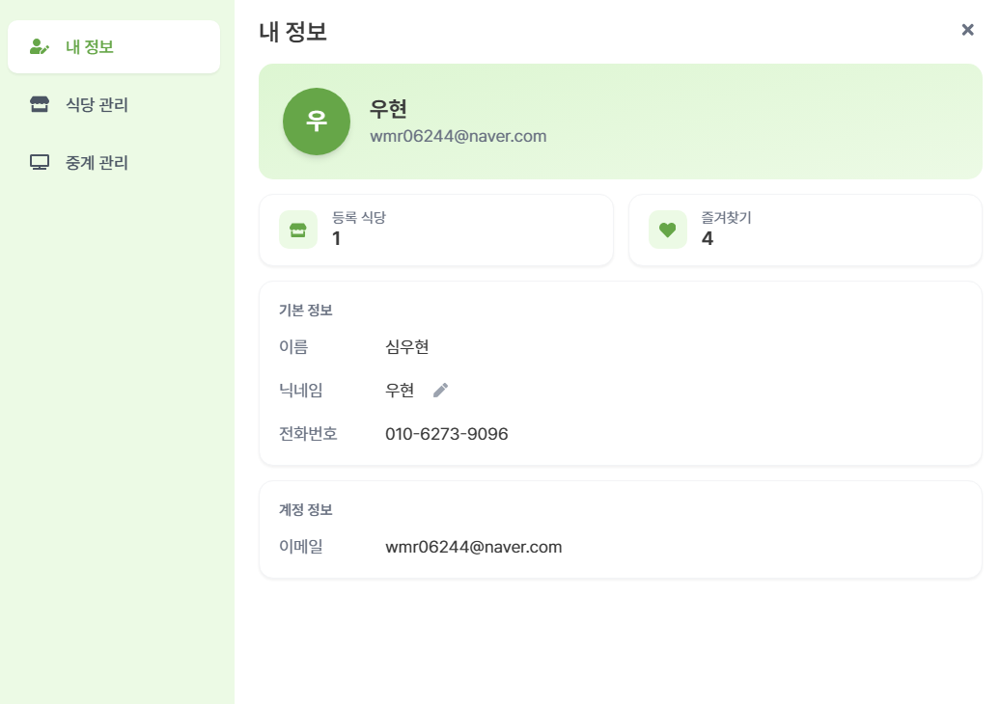

<div align="center">

# Playce

### 스포츠 중계 맛집 찾기

내 주변에서 좋아하는 경기를 함께 응원할 수 있는 곳을 찾아보세요.

[](https://playce-app.vercel.app)

<br>


</div>

---

## 기획 의도

직관 티켓은 비싸고, 혼자 집에서 보기엔 아쉽고.
**"근처 식당에서 같이 응원할 수 있으면 좋겠다"** 는 단순한 아이디어에서 시작했습니다.

카카오맵 위에 스포츠 중계를 하는 식당을 표시하고, 종목/지역/날짜로 검색하고, 즐겨찾기로 관리할 수 있는 **위치 기반 스포츠 중계 맛집 플랫폼**입니다.

---

## 주요 화면

| 지도 + 검색 + 오늘의 중계 | 마커 팝업 |
|:---:|:---:|
|  |  |

| 검색 결과 + 상세보기 | 오늘의 중계 (모바일) |
|:---:|:---:|
|  |  |

| 즐겨찾기 | 마이페이지 (프로필) |
|:---:|:---:|
|  |  |

| 식당 등록 | 중계 일정 캘린더 |
|:---:|:---:|
|  |  |

---

## 기술 스택

| 분류 | 기술 |
|------|------|
| Frontend | React 19, TypeScript, Vite 6 |
| 상태관리 | Zustand 5 (UI), TanStack React Query 5 (서버) |
| 스타일링 | Tailwind CSS 3, Framer Motion 12 |
| 폼 | React Hook Form 7 |
| 지도 | Kakao Maps SDK |
| Testing | Vitest 4, Playwright |
| CI/CD | GitHub Actions (테스트 + 보안 감사) |
| 배포 | Vercel (FE), Render (BE) |

---

## 프로젝트 정보

| 항목 | 내용 |
|------|------|
| 팀 구성 | 6명 (FE 3 + BE 3) |
| 기간 | 2025.06 (팀 개발) + 2026.03 (단독 리팩토링) |
| 역할 | **프론트엔드 메인 개발자** |
| 코드 기여 | FE 125개 파일 중 **97개 직접 작성 (52%)** |
| 리팩토링 | **단독 15단계, 61개 PR** |

---

## 내가 담당한 기능

### 카카오맵 기반 검색
- 카카오맵 SDK 연동 + Geolocation API 현위치 표시
- 다중 필터(종목/리그/지역/날짜) 조합 검색 + 거리/날짜 정렬
- 도시 퀵네비(12개 도시) — 클릭 시 지도 이동 + 자동 접힘
- 마커 클릭 → 팝업 → 상세보기 연결 플로우

### 식당 상세보기
- 탭 구조: 홈 / 메뉴 / 사진 / 중계
- 중계 탭: 과거/미래 분리, 날짜별 그룹핑, 시간순 정렬
- 즐겨찾기 토글 + 카카오톡 공유

### 오늘의 중계
- LIVE 배지 실시간 하이라이트 + 종목 탭 필터
- 가게 지역 + 거리 표시, 카드 클릭 → 상세보기

### 즐겨찾기
- 비로그인 시 로그인 유도 UI
- 가게별 다가오는 중계 토글
- Zustand + React Query 연동

### 마이페이지
- **프로필**: 유저 정보, 등록 식당 수, 즐겨찾기 수
- **식당 관리**: 등록/수정/삭제 (React Hook Form + 주소 API + 이미지 업로드)
- **중계 관리**: 월별 달력으로 일정 관리, 종목/리그/팀 입력

### 인증
- 로그인/회원가입 모달 + 모달 간 전환
- JWT 토큰 인증 (`useAuth` 훅) + 401 인터셉터 자동 로그아웃
- 비밀번호 초기화 (이메일 → 토큰 기반 리셋)

---

## 단독 리팩토링 (P1 ~ P15)

팀 개발 종료 후, 코드 품질·성능·테스트·CI를 **단독으로 15단계에 걸쳐 개선**했습니다.


### 단계별 요약

| 단계 | 내용 |
|:---:|------|
| **P1~P3** | 데드코드 제거, 디렉토리 구조 정리, Path Alias, 버그 수정 |
| **P4** | **React Query 도입** — 서버/클라이언트 상태 분리 |
| **P5** | **React Hook Form 도입** — 폼 관리 일원화 |
| **P6** | **코드 스플리팅** — lazy() + Suspense, MypageModal **90% 감소** |
| **P7** | **렌더링 + 번들 최적화** — memo/useMemo/useCallback, manualChunks 7개 분리 |
| **P8~P9** | 안티패턴 정리, UX/UI 개선, 디자인 토큰 통일 |
| **P10~P12** | 반응형 레이아웃, 기능 추가, 랜딩 리디자인 |
| **P13** | **테스트 137개** — Vitest 단위 109개 + Playwright E2E 28개 |
| **P14** | **GitHub Actions CI** — PR 자동 테스트 + Playwright 브라우저 캐싱 |
| **P15** | **ErrorBoundary + Skeleton + Web Vitals + npm audit** |

### 성과 수치

| 항목 | Before | After | 변화 |
|------|:------:|:-----:|:----:|
| 메인 번들 | 510KB | 295KB | **-42%** |
| MypageModal | 311KB | 31KB | **-90%** |
| TBT (Lighthouse) | 280ms | 180ms | **-36%** |
| 테스트 | 0개 | 137개 | Unit 109 + E2E 28 |
| CI | 없음 | GitHub Actions | 테스트 + 보안 감사 |
| React.memo | 0 | 10개 | 리스트 아이템 최적화 |
| useMemo | 3 | 17개 | 비싼 계산 캐싱 |
| useCallback | 0 | 11개 | 핸들러 참조 안정화 |
| Zustand 셀렉터 | 0 | 34개 | 리렌더링 범위 축소 |

---

## 아키텍처

```
src/
├── pages/           # 3개 페이지 (Landing, Home, SearchPage)
├── components/      # 68개 컴포넌트 (10개 도메인 폴더)
│   ├── auth/        # 로그인, 회원가입, 비밀번호 초기화
│   ├── broadcast/   # 오늘의 중계 사이드바
│   ├── common/      # Button, Toast, Skeleton, ErrorBoundary
│   ├── map/         # 카카오맵 마커, 팝업, 퀵네비
│   ├── mypage/      # 프로필, 식당관리, 중계관리
│   ├── restaurant/  # 상세보기 (홈/메뉴/사진/중계 탭)
│   └── search/      # 검색, 필터 모달, 결과 리스트
├── hooks/           # 15개 커스텀 훅 (useAuth, useFavorites 등)
├── stores/          # 9개 Zustand 스토어
├── utils/           # 9개 유틸 (날짜, 정렬, 지역, Web Vitals)
├── types/           # 9개 타입 정의
└── api/             # Axios 인스턴스 + API 함수
```

### 상태 관리 구조

```
Zustand (UI 상태)              React Query (서버 상태)
├── mapStore (지도 좌표/줌)     ├── useNearbyRestaurants
├── searchStore (검색 조건)     ├── useSearchResults
├── authStore (로그인 상태)     ├── useFavorites
├── toastStore (알림)          ├── useStoreDetail
├── regionStore (지역 필터)     ├── useBroadcasts
└── sportStore (종목 필터)      └── useMyStores
```

---

## 테스트

```
tests/
├── unit/  (Vitest, 109개, ~7초)
│   ├── formatTime, dateUtils, openStatus   # 유틸 함수
│   ├── sortUtils, regionUtils, sportUtils  # 비즈니스 로직
│   └── mapStore, searchStore, toastStore   # Zustand 스토어
└── e2e/   (Playwright, 28개, ~2분)
    ├── auth.spec.ts          # 로그인, 회원가입
    ├── favorites.spec.ts     # 즐겨찾기
    ├── broadcast.spec.ts     # 오늘의 중계
    ├── search.spec.ts        # 검색 + 필터 모달
    ├── map.spec.ts           # 지도, 도시 퀵네비
    ├── mypage-store.spec.ts  # 식당 관리
    └── mypage-broadcast.spec.ts  # 중계 관리, 프로필
```

### CI 파이프라인

```
PR 생성 → 3개 job 병렬 실행
  ├── Unit Tests (Vitest 109개)
  ├── E2E Tests (Playwright 28개)
  └── Security Audit (npm audit)
```

---

## 실행 방법

```bash
# 프론트엔드
cd frontend
npm install
npm run dev          # http://localhost:5173

# 테스트
npm test             # 단위 테스트
npm run test:e2e     # E2E 테스트
```

---

> 이전 README: [before_readme.md](./before_readme.md)
