# ⚽ Playce (Frontend)

> 사용자 위치 기반의 식당 검색과 스포츠 중계 정보 제공을 결합한 플랫폼 **Playce**의 프론트엔드 레포지토리입니다.  
> React 기반의 **SPA(Single Page Application)**으로, 지도 기반 UI와 경기, 종목별 통합 검색 기능, 식당 즐겨찾기 기능, 식당별 중계 내용과 중계 관리 기능까지 다양한 기능을 제공합니다.
> 
> 🔗 배포 주소: http://3.35.146.155:3000/

---

## 🛠️ 기술 스택

| 분류        | 기술                 |
| ----------- | -------------------- |
| 프레임워크  | React 18, TypeScript |
| 상태관리    | Zustand              |
| 네트워크    | Axios, qs            |
| 스타일      | Tailwind CSS         |
| UI 컴포넌트 | React Icons          |
| 맵 API      | Kakao Maps SDK       |
| 인증/계정   | JWT                  |
| 라우팅      | React Router DOM     |
| 배포        | AWS EC2            |

---

## 📁 프로젝트 구조
```
📦 frontend/src
├── api                # 서버 통신 axios/fetch 모듈
├── components         # 기능별/공통 UI 컴포넌트 
│   ├── AppHeader              # 전체 상단 헤더/로고
│   ├── Auth                   # 로그인, 회원가입, 인증 관련
│   ├── Common                 # Button, Modal, Toast, 별점 등 공용 UI
│   ├── FavoriteSidebar        # 즐겨찾기 사이드바, 별도 UI
│   ├── Map                    # 지도, 핀, 마커, 위치 기반 연동
│   ├── Mypage                 # 내 정보, 내 식당/중계 관리, 마이페이지
│   ├── RestaurantCardList     # 검색/오늘중계 등 식당 리스트형 카드
│   ├── RestaurantDetail       # 상세보기(탭/이미지/메뉴/중계)
│   ├── Search                 # 통합검색 패널 및 컨트롤
│   ├── Select                 # 드롭다운, 필터 등 선택 UI
│   └── TodayBroadcasts        # 오늘의 중계일정, 스포츠 탭/경기카드 등
├── constants          # 상수 데이터 (기본 위치, 맵 반경 등)
├── data               # 지역, 스포츠, 리그 분류/매핑 유틸
├── hooks              # 커스텀 훅 (상태/이벤트/UI 공통 처리)
├── pages              # 라우팅되는 주요 페이지(메인, 마이, 상세)
├── stores             # Zustand 기반 글로벌 상태 관리
├── types              # TS 타입 정의
├── utils              # 유틸(좌표 변환, 시간 포맷, 쿼리 등)
```
---

## 🗂️ Zustand stores 상태 관리 구조 (`stores/`)

Playce 프론트엔드의 전역 상태 관리는 **Zustand** 기반으로 각 도메인별 store를 분리해 확장성과 유지보수성을 높였습니다.

아래는 실제 `stores/` 디렉토리 구조와 주요 기능별 설명입니다.

```
stores/
├── authStore.ts             # 로그인/회원인증/모달상태/토큰저장
├── bookmarkStore.ts         # 북마크(즐겨찾기) 리스트 상태
├── broadcastFormStore.ts    # 중계 일정 등록/수정 폼 상태
├── broadcastStore.ts        # 중계 일정 일정(캘린더·리스트·탭) 상태
├── favoriteStore.ts         # 백엔드 연동 즐겨찾기(서버) 리스트
├── mapStore.ts              # 지도 상태(좌표, 가게목록, 모달, 줌 등)
├── mypageStore.ts           # 마이페이지(탭, 내 식당, 중계 편집) 상태
├── regionStore.ts           # 지역(시/구) 선택, 토글/필터
├── searchStore.ts           # 검색 키워드, 지역/종목 필터, 결과관리
├── sportStore.ts            # 종목/리그 필터 상태 관리
```

---

### 🧩 스토어별 상태/기능 요약

#### `authStore.ts`
- 로그인/회원가입 모달 on/off, isLoggedIn, 비밀번호 재설정
- JWT 토큰 저장/삭제 (로그인/로그아웃 → 전역 연동)

#### `bookmarkStore.ts`
- 북마크(즐겨찾기) 식당 목록 관리 (add/remove)
- 로컬 상태 기반 즐겨찾기 관리 (프론트 단)

#### `favoriteStore.ts`
- 서버 API와 연동된 즐겨찾기(찜) 식당 관리
- `fetch`, `add`, `remove` 등 비동기 처리

#### `broadcastFormStore.ts`
- 중계 일정 폼 입력값 관리 (날짜, 종목, 리그, 팀명 등)
- 등록/수정을 위한 폼 리셋 및 필드 상태 관리

#### `broadcastStore.ts`
- 중계 일정 조회 및 필터링 (년/월/일/식당/뷰타입 등)
- 뷰(탭, 캘린더) 선택 및 리스트/스크롤 참조값 관리

#### `mapStore.ts`
- 지도 중심좌표, 식당 리스트, 줌레벨, 모달 상태
- 지도 refresh, 재탐색, 식당/중계 동기화, 줌 관리

#### `mypageStore.ts`
- 마이페이지 탭 상태, 내 식당 편집, 서브페이지 상태
- 내 식당 수정/상세 보기 상태 관리

#### `regionStore.ts`
- 시/구 단위 지역 선택 (다중/토글 방식)
- 지역 필터 초기화 및 선택 상태 저장

#### `searchStore.ts`
- 검색어, 지역/종목/리그, 정렬/필터 등 검색 상태 전반 관리
- 검색 트리거, 결과 리스트, 초기화 기능 포함

#### `sportStore.ts`
- 종목/리그 단위 선택 및 필터 상태 관리
- 전체 초기화, 다중선택 등 UI 필터링 기능과 연동

---

## 🚀 주요 기능

### 🧭 SPA 구조 & 레이아웃 구성

- 프로젝트는 **SPA** 구조로 구성되며, 주요 UI는 다음과 같은 **레이아웃 기반으로 구동**됩니다:

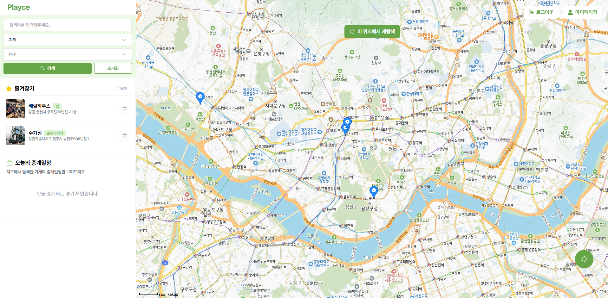

- 좌측 사이드바 (로고 + 통합검색 + 즐겨찾기 + 오늘의 중계)
- 우측 지도 (로그인, 회원가입, 마이페이지, 지도 핀, 모달)

---

### 🧩 기능 상세

#### 📍 위치 기반 식당 탐색


- 현재 위치를 기준으로 지도에 등록된 식당 핀 표시
- 지도에 표시된 식당은 사장이 사업자등록번호 검증 후 직접 등록한 곳만 노출
- 지도 핀 클릭 시 모달로 상세 정보 + **가까운 경기 중계 정보** 표시
- `상세보기` 버튼 클릭 시 식당 전용 상세 페이지로 이동

#### 🔍 통합 검색

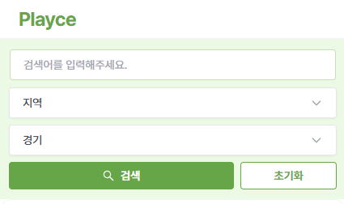
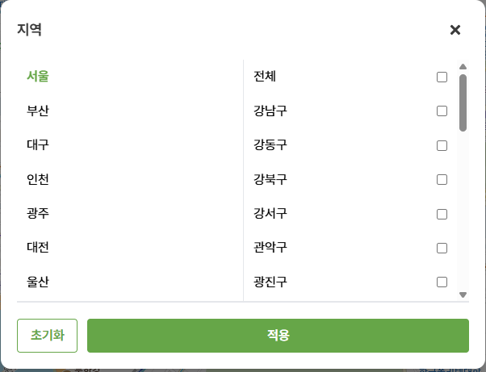
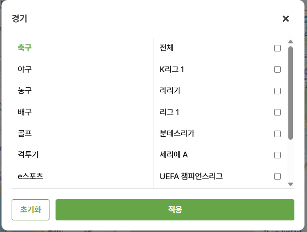

<br>

- **사이드바 최상단**에 위치
- 검색어 입력 또는 조건 기반 검색 지원
  - 지역: 시 → 구 (예: 서울 > 강남구)
  - 종목: 축구, 농구, 야구, 배구, 골프, 격투기, e스포츠 등
  - 리그: 종목별 하위 리그 선택 가능 (예: K리그, 챔스 등)
- 결과는 필터 기준에 부합하는 **중계 포함 식당 리스트**
  - 정렬 옵션: 거리순 / 날짜순
  - 클릭 시 상세보기 페이지로 이동

#### ⭐ 즐겨찾기

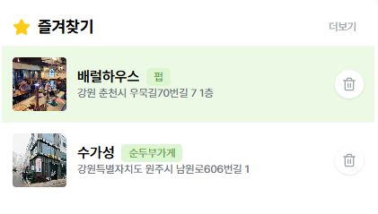

- 로그인한 사용자가 즐겨찾기한 식당 리스트 제공
- 상단 사이드바에서 빠르게 접근 가능

#### 📅 오늘의 중계


- 현재 날짜에 중계가 포함된 식당만 필터링하여 리스트로 제공
- 클릭 시 해당 식당의 상세정보로 이동

#### 🏠 식당 상세 페이지

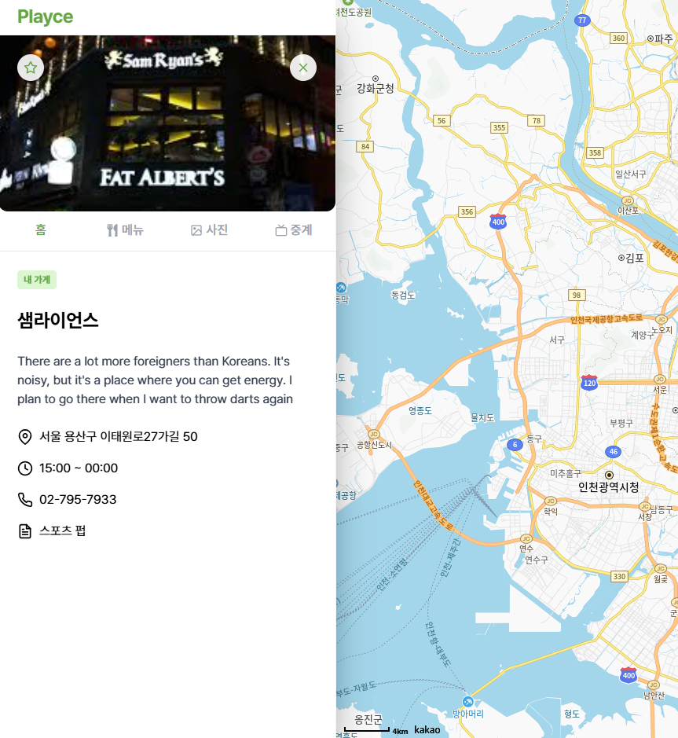

- 탭 구성: `홈`, `메뉴`, `사진`, `중계`
  - **홈 탭**: 식당 기본 정보 (이름, 주소, 영업일자, 전화번호 등)
  - **중계 탭**: 중계 일정 확인
    - 사장 계정일 경우: `중계 관리 탭` 활성화
    - 미래 중계는 가까운 일정 순서로 정렬
    - 지난 중계는 토글로 숨김/표시 가능

#### 👤 마이페이지

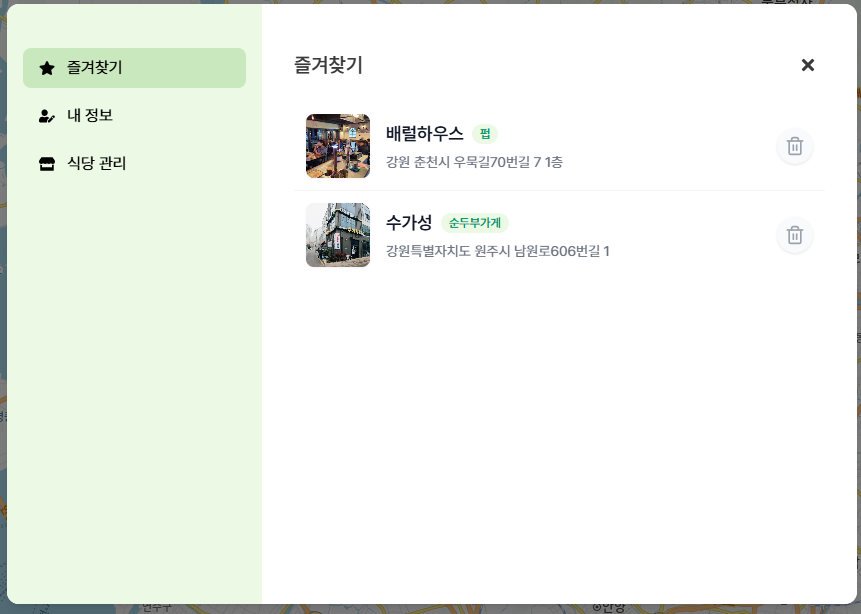

- 메뉴 구성: `내 정보`, `즐겨찾기`, `식당 관리`
  - **식당 관리**: 내가 등록한 식당의 중계 일정 관리 진입 가능

#### 🗓️ 중계 일정 관리 (사장용)

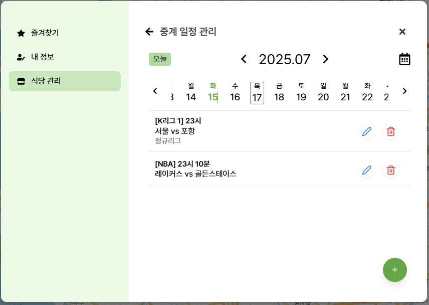
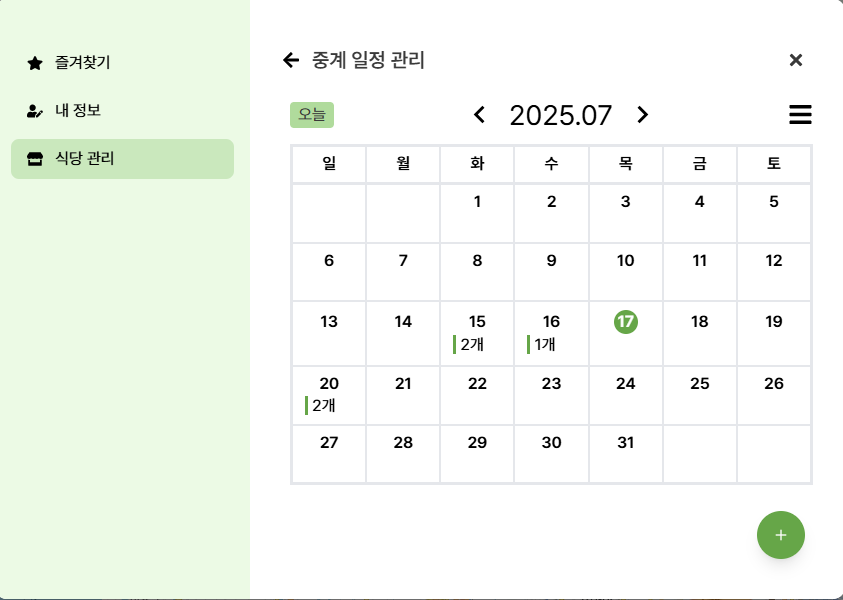

- 사장이 등록한 식당에 한해 중계 등록/수정/삭제 가능
- 뷰 타입: `캘린더형 보기` + `리스트형 보기` 제공
- 오늘 버튼 클릭 시 오늘 날짜로 빠른 이동 가능

#### 🔐 인증 / 로그인

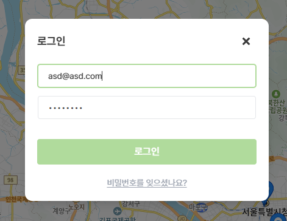
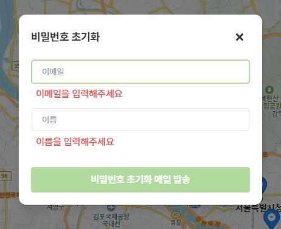

- 이메일 기반 회원가입/로그인
- 비밀번호 분실 시 **이메일로 초기화 링크 전송** 방식 제공

---

## ⚙️ 로컬 개발 환경 세팅

```bash
# 패키지 설치
npm install

# 개발 서버 실행
npm run dev
```

### 🔐 .env 설정

`.env` 파일에 다음을 추가해야 정상 실행됩니다:

```
VITE_KAKAO_MAP_KEY=your_kakao_map_api_key
```

---

## 🧩 브랜치 & 커밋 컨벤션

### 🔀 브랜치 네이밍

```
FE/#이슈번호/기능설명
```

예시:

```
FE/#12/중계-일정-탭-구현
```

### ✅ 커밋 메시지 규칙

| 태그     | 설명                   |
| -------- | ---------------------- |
| Feat     | 기능 추가              |
| Fix      | 버그 수정              |
| Style    | 스타일 변경 (로직 X)   |
| Refactor | 코드 리팩토링          |
| Docs     | 문서 수정              |
| Chore    | 설정 파일 수정 등 기타 |

예시:

```
Feat: 오늘의 중계 리스트 추가
Fix: 중계 탭에서 지난 경기 표시 오류 수정
```

---

## 📌 기타

- 모든 페이지는 **React Router 기반 SPA 구조**로 구성되어 빠른 화면 전환이 가능합니다.
- API 연동은 백엔드 Swagger 명세 기반으로 이루어졌으며, axios와 qs를 활용해 HTTP 요청 및 파라미터 직렬화를 처리합니다.
- UI는 `Figma` 기반 시안에 맞춰 제작되었으며, 향후 화면은 반응형 대응을 고려하여 개발할 예정입니다.

---

> 본 문서는 프로젝트의 프론트엔드 구조 및 주요 기능 흐름을 빠르게 이해하고 개발 및 유지보수를 용이하게 하기 위한 개발자 가이드입니다.
